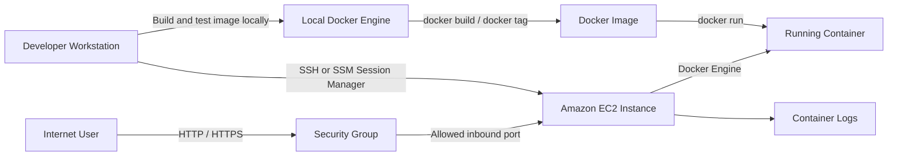
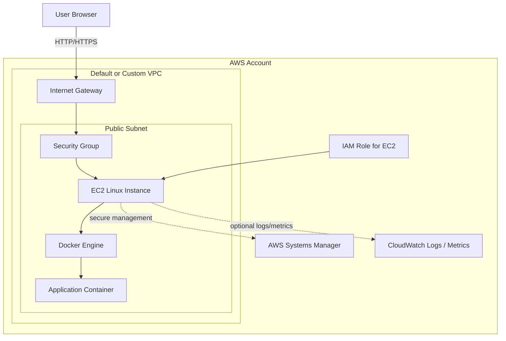
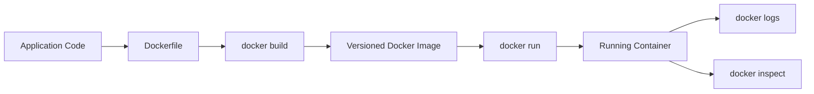
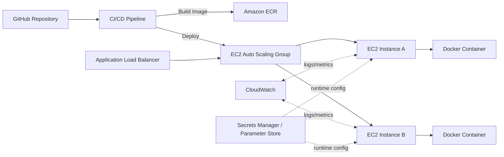

# AWS EC2 Docker Deployment Journey

This repository documents a practical DevOps learning path for running containerized applications on AWS EC2 with Docker. It is written as both a study guide and a deployment runbook, showing how an application can move from a local Docker image to a secure cloud-hosted service.

The goal is not only to learn Docker commands, but to understand the surrounding AWS infrastructure: EC2, IAM, security groups, SSH, Systems Manager Session Manager, Docker image builds, container runtime behavior, and operational checks.

## What This Project Demonstrates

- Provisioning an EC2 instance for a Docker workload
- Securing access with IAM, key pairs, security groups, and least privilege
- Connecting with SSH and AWS Systems Manager Session Manager
- Installing and validating Docker on a Linux server
- Building, tagging, running, inspecting, and removing Docker images and containers
- Exposing a containerized web service through EC2 networking
- Documenting a repeatable cloud deployment workflow
- Thinking like a DevOps engineer: security, automation, observability, recovery, and cost awareness

## High-Level Architecture



## AWS Deployment Architecture



## Core Concepts

### EC2

Amazon Elastic Compute Cloud, or EC2, provides virtual servers in AWS. In this project, EC2 acts as the host machine where Docker is installed and where containers run.

Important EC2 concepts:

- **AMI:** The operating system image used to launch the instance, such as Amazon Linux or Ubuntu.
- **Instance type:** The compute size, such as `t2.micro` or `t3.micro` for free-tier-friendly labs.
- **Key pair:** SSH credential used to connect to the instance.
- **Security group:** Virtual firewall controlling inbound and outbound traffic.
- **Public IP / DNS:** Address used to reach the instance from the internet.
- **User data:** Startup script that can install packages and bootstrap the server.
- **IAM role:** Permissions attached to the instance so it can call AWS services without storing access keys on the server.

### Docker

Docker packages an application and its dependencies into a portable image. A running instance of that image is called a container.

Key Docker objects:

- **Dockerfile:** Instructions for building an image.
- **Image:** Immutable package containing app code, runtime, dependencies, and metadata.
- **Container:** Running process created from an image.
- **Port mapping:** Connects a host port to a container port, such as `-p 80:80`.
- **Volume:** Persists data outside the container lifecycle.
- **Registry:** Stores and distributes images, such as Docker Hub or Amazon Elastic Container Registry.

## Recommended AWS Setup

For a learning environment, start simple:

| Component | Recommendation | Reason |
| --- | --- | --- |
| Region | Closest AWS region | Lower latency and easier management |
| AMI | Amazon Linux 2023 or Ubuntu LTS | Stable Linux base for Docker |
| Instance type | `t2.micro` or `t3.micro` | Suitable for labs and free-tier usage |
| Storage | 8-20 GB gp3 EBS | Enough for Docker images and logs |
| Access | Session Manager preferred, SSH optional | Reduces exposed management ports |
| Inbound rules | HTTP/HTTPS only for app traffic | Smaller attack surface |
| IAM role | EC2 role with SSM permissions | Secure management without static keys |

## IAM and Security Model

Avoid placing AWS access keys directly on the EC2 instance. Use an IAM role attached to the instance instead.

Recommended IAM approach:

1. Create or use an IAM role for EC2.
2. Attach `AmazonSSMManagedInstanceCore` so the instance can be managed through Systems Manager.
3. If pulling images from Amazon ECR later, attach the minimum ECR read permissions required.
4. Avoid administrator permissions for lab instances unless absolutely necessary.
5. Rotate SSH keys and remove unused key pairs.

Example permissions for a future ECR pull workflow:

```json
{
  "Version": "2012-10-17",
  "Statement": [
    {
      "Effect": "Allow",
      "Action": [
        "ecr:GetAuthorizationToken",
        "ecr:BatchCheckLayerAvailability",
        "ecr:GetDownloadUrlForLayer",
        "ecr:BatchGetImage"
      ],
      "Resource": "*"
    }
  ]
}
```

Security group baseline:

| Type | Port | Source | Notes |
| --- | --- | --- | --- |
| SSH | 22 | Your IP only | Optional if using SSH |
| HTTP | 80 | `0.0.0.0/0` | Only if hosting a public web app |
| HTTPS | 443 | `0.0.0.0/0` | Preferred for production |
| App test port | 8080 | Your IP only | Useful for temporary testing |

## EC2 Instance Setup

### 1. Launch the Instance

In the AWS Console:

1. Open **EC2**.
2. Choose **Launch instance**.
3. Name the instance, for example `docker-devops-lab`.
4. Select **Amazon Linux 2023** or **Ubuntu LTS**.
5. Choose `t2.micro` or `t3.micro`.
6. Select or create a key pair if SSH will be used.
7. Attach a security group with only required inbound ports.
8. Attach an IAM role with `AmazonSSMManagedInstanceCore`.
9. Launch the instance.

### 2. Connect with Session Manager

Session Manager is preferred because it avoids opening port `22` to the internet.

Requirements:

- SSM Agent installed on the AMI
- EC2 instance has an IAM role with `AmazonSSMManagedInstanceCore`
- Instance can reach SSM endpoints through internet access or VPC endpoints

Connection path:

1. Open **AWS Systems Manager**.
2. Go to **Session Manager**.
3. Start a session.
4. Select the EC2 instance.
5. Connect to the shell.

### 3. Connect with SSH

If using SSH, restrict port `22` to your public IP.

```bash
chmod 400 your-key.pem
ssh -i your-key.pem ec2-user@your-ec2-public-ip
```

For Ubuntu AMIs:

```bash
ssh -i your-key.pem ubuntu@your-ec2-public-ip
```

## Install Docker on EC2

### Amazon Linux 2023

```bash
sudo dnf update -y
sudo dnf install docker -y
sudo systemctl enable docker
sudo systemctl start docker
sudo usermod -aG docker ec2-user
docker --version
```

After adding the user to the Docker group, log out and reconnect before running Docker without `sudo`.

### Ubuntu

```bash
sudo apt-get update
sudo apt-get install -y ca-certificates curl gnupg
sudo install -m 0755 -d /etc/apt/keyrings
curl -fsSL https://download.docker.com/linux/ubuntu/gpg | sudo gpg --dearmor -o /etc/apt/keyrings/docker.gpg
sudo chmod a+r /etc/apt/keyrings/docker.gpg
echo "deb [arch=$(dpkg --print-architecture) signed-by=/etc/apt/keyrings/docker.gpg] https://download.docker.com/linux/ubuntu $(. /etc/os-release && echo $VERSION_CODENAME) stable" | sudo tee /etc/apt/sources.list.d/docker.list > /dev/null
sudo apt-get update
sudo apt-get install -y docker-ce docker-ce-cli containerd.io docker-buildx-plugin docker-compose-plugin
sudo usermod -aG docker ubuntu
docker --version
```

## Docker Image Workflow

The typical workflow is:



Example image build:

```bash
docker build -t devops-docker-app:1.0 .
docker images
```

Example container run:

```bash
docker run -d --name devops-app -p 80:80 devops-docker-app:1.0
docker ps
```

Example validation:

```bash
curl http://localhost
docker logs devops-app
docker inspect devops-app
```

## Example Dockerfile

This repository does not yet contain a full application, but a simple web image could look like this:

```Dockerfile
FROM nginx:1.27-alpine

COPY ./public /usr/share/nginx/html

EXPOSE 80

CMD ["nginx", "-g", "daemon off;"]
```

For a Node.js application, a production-minded Dockerfile could look like this:

```Dockerfile
FROM node:22-alpine AS dependencies
WORKDIR /app
COPY package*.json ./
RUN npm ci

FROM node:22-alpine AS runtime
WORKDIR /app
ENV NODE_ENV=production
COPY --from=dependencies /app/node_modules ./node_modules
COPY . .
EXPOSE 3000
CMD ["npm", "start"]
```

Good image practices:

- Use small base images where possible.
- Pin major runtime versions.
- Keep secrets out of images.
- Use `.dockerignore` to avoid copying unnecessary files.
- Prefer non-root users for production containers.
- Tag images with meaningful versions, not only `latest`.
- Rebuild images from source instead of modifying running containers manually.

## Useful Docker Commands

| Command | Purpose |
| --- | --- |
| `docker images` | List local images |
| `docker ps` | Show running containers |
| `docker ps -a` | Show all containers |
| `docker run nginx` | Run an nginx container |
| `docker run -d --name my-nginx nginx` | Run nginx in detached mode |
| `docker exec -it my-nginx bash` | Open a shell inside a container |
| `docker exec -it my-nginx nginx -t` | Test nginx config inside the container |
| `docker logs my-nginx` | View container logs |
| `docker stop my-nginx` | Stop a running container |
| `docker rm my-nginx` | Remove a stopped container |
| `docker rmi nginx` | Remove an image |
| `docker system df` | Show Docker disk usage |
| `docker system prune` | Clean unused Docker resources |

## Running Nginx as a First EC2 Container

Start with a known image:

```bash
docker run -d --name web-test -p 80:80 nginx
docker ps
curl http://localhost
```

From your browser:

```text
http://your-ec2-public-ip
```

If the browser cannot connect:

1. Confirm the container is running with `docker ps`.
2. Confirm nginx responds locally with `curl http://localhost`.
3. Confirm the EC2 security group allows inbound TCP `80`.
4. Confirm the instance is in a public subnet with a route to an internet gateway.
5. Confirm the network ACL is not blocking the request.

## Operational Checklist

Before calling a deployment complete:

- EC2 instance is reachable through Session Manager or restricted SSH.
- Docker service starts automatically after reboot.
- Application container restarts correctly if the instance restarts.
- Security group exposes only required ports.
- No credentials are stored in the image, repository, or shell history.
- Logs can be viewed with `docker logs`.
- Disk usage has been checked with `docker system df`.
- Application health has been tested with `curl`.
- README contains the exact run commands needed to reproduce the setup.

Optional restart policy:

```bash
docker run -d --restart unless-stopped --name devops-app -p 80:80 devops-docker-app:1.0
```

## Troubleshooting

| Problem | Likely Cause | Fix |
| --- | --- | --- |
| `Permission denied` when running Docker | User is not in Docker group | Run `sudo usermod -aG docker <user>`, then reconnect |
| Browser cannot reach app | Security group or subnet route issue | Check inbound rules, public IP, and internet gateway route |
| Container exits immediately | Bad command or app crash | Run `docker logs <container>` |
| Port already allocated | Another process uses the port | Use `docker ps` or run on a different host port |
| No space left on device | Too many images/logs | Run `docker system df` and prune unused resources |
| SSM connection unavailable | Missing IAM role or SSM connectivity | Attach SSM role and confirm outbound internet/VPC endpoints |

## Production Improvements

This EC2-based setup is useful for learning and small deployments. For production, the architecture can mature into:

- **Amazon ECR** for private Docker image storage.
- **Application Load Balancer** for traffic distribution and TLS termination.
- **Auto Scaling Group** for self-healing EC2 capacity.
- **CloudWatch** for metrics, logs, and alarms.
- **AWS Systems Manager Parameter Store or Secrets Manager** for configuration and secrets.
- **Terraform or CloudFormation** for repeatable infrastructure.
- **GitHub Actions** for CI/CD builds and deployments.
- **Amazon ECS or EKS** when container orchestration is required.

Possible production architecture:



## Learning Reference

This repository follows concepts from:

- Course: **Learn Docker - Full DevOps Course for Deploying Containerized Apps**
- Channel: **freeCodeCamp.org**
- Source: https://youtu.be/rjjES5IsPdg?si=p0z8punLTGjQ2g1Y

## Personal Learning Goals

By the end of this journey, this repository should show that I can:

- Explain containers, images, and Docker runtime behavior.
- Configure a secure EC2 instance for container workloads.
- Use IAM roles instead of hard-coded AWS credentials.
- Connect to cloud servers through SSH and Session Manager.
- Deploy and troubleshoot a containerized application.
- Document infrastructure decisions clearly.
- Think beyond "it runs" toward security, repeatability, monitoring, and maintainability.
